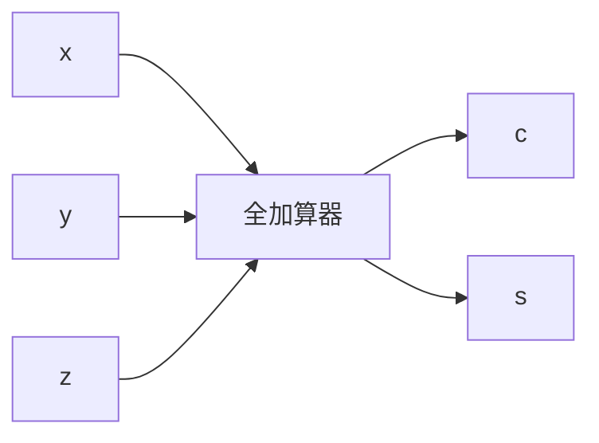

## 問題1

1ビットの数A，Bの和を2ビットで表現したとき，上位ビットCと下位ビットSを表す論理式の組合せはどれか。ここで，"・"は論理積，"＋"は論理和，X はXの否定を表す。

| A | B | AとBの和 |   |
|:-:|:-:|:-------:|:-:|
|   |   |    C    | S |
| 0 | 0 |    0    | 0 |
| 0 | 1 |    0    | 1 |
| 1 | 0 |    0    | 1 |
| 1 | 1 |    1    | 0 |

|    |    C    |         S         |
|:--:|:-------:|:-----------------:|
| ア |  A · B  | (A · B̄) + (Ā · B) |
| イ |  A · B  | (A + B) · (Ā + B̄) |
| ウ |  A + B  | (A · B̄) + (Ā · B) |
| エ |  A + B  | (A + B) · (Ā + B̄) |

### 解答

上位ビットCと下位ビットSを表す論理式の組合せを考える

C:
- C は A と B が両方 1 のとき 1 になる
- C = A · B (AND)

S:
- Sは、AとBのどちらか一方だけが1の時に1になる
- S = A · B̄ + Ā · B (XOR)

C = A · B となるのは、ア・イ
S = (A · B̄) + (Ā · B) となるのは、ア

よって、答えはア

## 問題2

図に示す1けたの2進数xとyを加算し，z(和の1けた目)及びc(けた上げ)を出力する半加算器において，AとBの素子の組合せとして，適切なものはどれか。


```mermaid
graph LR
    y --> A
    y --> B
    A --> z[z (排の1けた目)]
    B --> c[c (けた上げ)]
```

| | A | B |
|:-:|:-:|:-:|
| ア | 排他的論理和 | 論理積 |
| イ | 否定論理積 | 否定論理和 |
| ウ | 否定論理和 | 排他的論理和 |
| エ | 論理積 | 論理和 |

### 解答

半加算器 = 排他的論理和 と 論理積 の組合せ

- z（和の1けた目）：
  - xとyのどちらか一方が1の場合に1になる
  - 排他的論理和 (XOR)

- c（けた上げ）：
  - xとyが両方1の場合に1になる
  - 論理積 (AND)

よって、答えはア

## 問題3

図は全加算器を表す論理回路である。図中のxに1，yに0，zに1を入力したとき，出力となるc(けた上げ数)，s(和)の値はどれか。



| | c | s |
|:-:|:-:|:-:|
| ア | 0 | 0 |
| イ | 0 | 1 |
| ウ | 1 | 0 |
| エ | 1 | 1 |

### 解答


図中のxに1，yに0，zに1を入力したとき = 1 + 0 + 1 = 2

2 を 2進数で表現すると 10

c = 1, s = 0

よって、答えはウ
